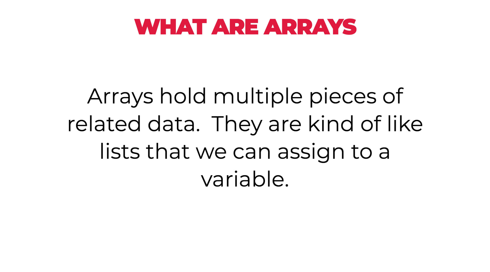
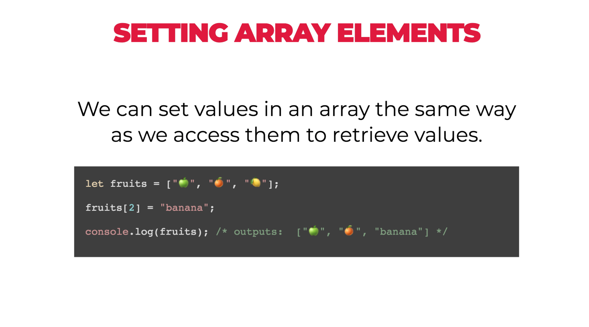
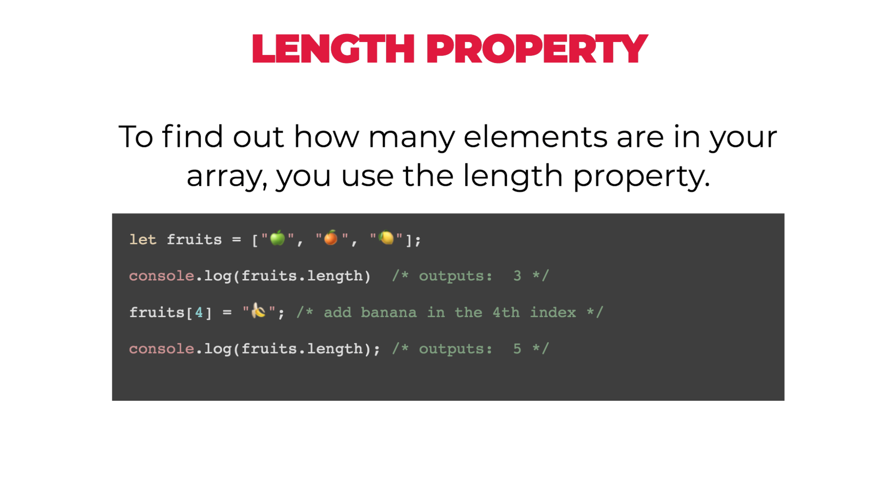
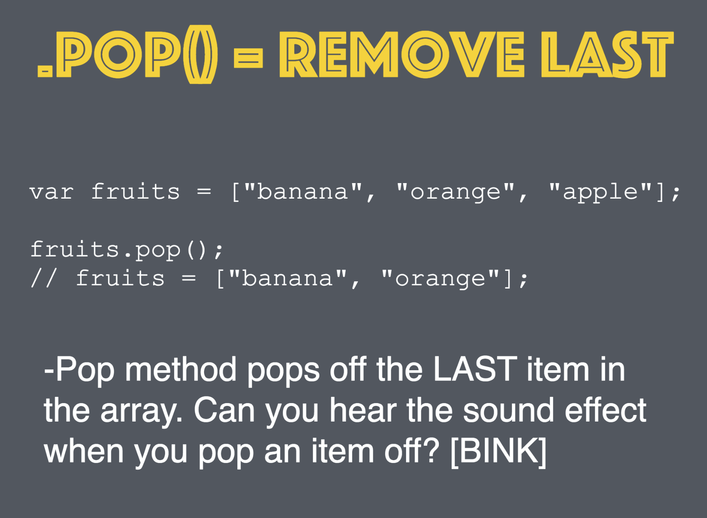

[](https://generalassemb.ly/education/web-development-immersive)

# JavaScript Arrays

## Objectives

By the end of this, developers should be able to:

- Define an array
- Store, access, and update data values in arrays
- Iterate over items in an array


## Preparation

1. Fork and clone this repository
1. Create a new branch, `training`, for your work and change into it.










### Code Along: Arrays

In JavaScript to represent a list we can use an [Array](https://developer.mozilla.org/en-US/docs/Web/JavaScript/Reference/Global_Objects/Array).
Elements in an `Array` or items in our list are ordered. JavaScript arrays are
zero-indexed: the first element of an array is at index 0, and the last element
is at the index equal to the value of the array's length property minus 1. Using
an invalid index number returns `undefined`.

```js
// Create an empty array literal
const list = [];

// Create an array literal with values
const anotherList = ['Nelly', 100, false, 2];

// Read value from an Array, use index
anotherList[0]; // 'Nelly'
anotherList[2]; // false

// Update value in an Array, use index
anotherList[2] = true;
anotherList; // ['Nelly', 100, true, 2]

// Add value to an Array, use index
anotherList[5] = 'Add Me';
anotherList; // ['Nelly', 100, true, 2, undefined, 'Add Me']
```

## Array Methods





## Iterating through Arrays


#### Code Along: Iterate through an Array

```js
const developers = ['Ahmad', 'Mike', 'Sami']

// Individually print message for each item in array
console.log('Hello ' + developers[0])
console.log('Hello ' + developers[1])
console.log('Hello ' + developers[2])

// Loop through array using i as the index
for (let i = 0; i < developers.length; i++) {
  console.log('Hello ' + developers[i])
}
```

## Array Practice

Createa  file named `practice.js` to save your solutions.

1. Using `push` and `unshift`, make this array contain the numbers from zero through seven:

```js
const arr = [2, 3, 4];

// your code here

arr; // => [0, 1, 2, 3, 4, 5, 6, 7]
```

2. What is *returned* by `push`? Before throwing this into the console, form a hypothesis about what you think the return value will be:

```js
const arr = [5, 7, 9];
arr.push(6); // returns ???
```

3. Change all odd numbers to be those numbers multiplied by two:
```js
const numbers = [4, 9, 7, 2, 1, 8];

  // your code here

numbers; // => [8, 18, 14, 4, 2, 16]
```

4. Change all **odd** numbers to be those numbers multiplied by two:
```js
const numbers = [4, 9, 7, 2, 1, 8];

  // your code here

numbers; // => [4, 18, 14, 2, 2, 8]
```

5.  Create an array to hold your favorite colors.  For each choice, log to the screen a string like: `My #1 choice is blue.`

5.  Create an array of ages.  Loop through and log only the ages that are over 21.

## Array Resources

- https://javascript.info/array
- https://javascript.info/array-methods
- https://medium.freecodecamp.org/javascript-arrays-and-objects-are-just-like-books-and-newspapers-6e1cbd8a1746
- https://www.codeanalogies.com/objects-arrays-practice/